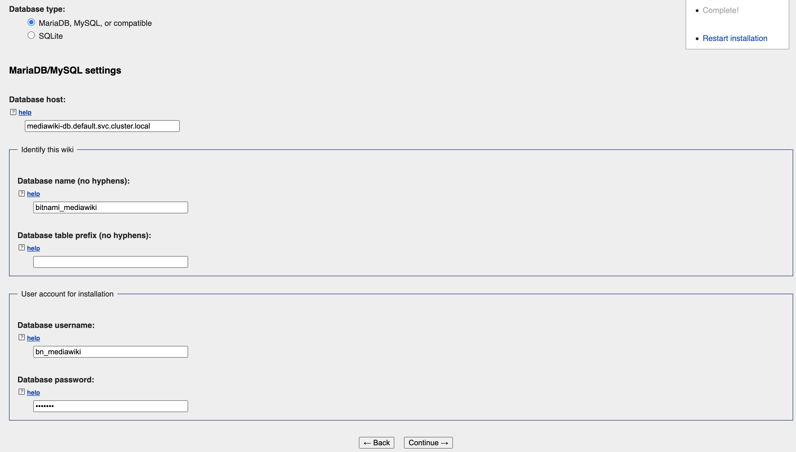
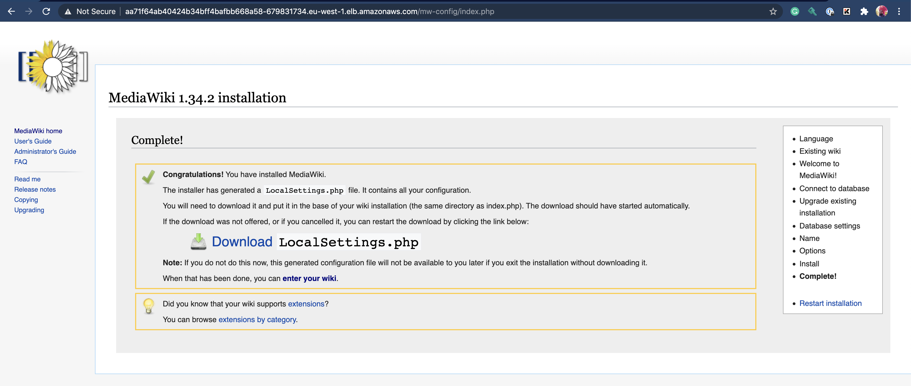

## Introduction


### Setup all the required tools
* install asdf https://asdf-vm.com/#/core-manage-asdf-vm
* add asdf plugins https://asdf-vm.com/#/plugins-all
    ```
    asdf plugin-add terraform
    asdf plugin-add terragrunt
    asdf plugin-add kubectl
    ```

* run `asdf install` from root of the repository
* install `aws-iam-authenticator` and `wget`

### Setup terragrunt
* assumption we are using "eu-west-1" region (in case you have to change find all occurrences of it and replace)
* Update config for `bucket` and `dynamodb_table` in `terraform/live/dev/terragrunt.hcl` file


### Setup VPC and EKS cluster together

  * set AWS_PROFILE environment variable
      ```
      pushd terraform/live/dev
      terragrunt plan-all
      terragrunt apply-all
      popd
      ```

### Setup VPC
* set AWS_PROFILE environment variable
    ```
    pushd terraform/live/dev
    terragrunt init
    terragrunt plan
    terragrunt apply
    popd
    ```
  
### Setup EKS Cluster
  * set AWS_PROFILE environment variable
      ```
      pushd terraform/live/dev/eks-cluster
      terragrunt init
      terragrunt plan
      terragrunt apply
      popd
      ```

### Install mediawiki
  * set KUBECONFIG
    ```
    export KUBECONFIG=terraform/live/dev/eks-cluster/kubeconfig_blue-kg-dev-cluster:~/.kube/config
    ```
  * Validate if all pod running
    ```
    kubectl get po -A
    ```
  * Apply MediaWiki K8s Template
    ```
      kubectl apply -f mediawiki-k8s/.
    ```
  * Check if all the pods started successfully
  * Get ELB loadbalancer endpoint
    ```
    kubectl get svc mediawiki-app
    ```
  * Open the RLB URL in browser
  * Database Details:
    - database host: mediawiki-db.default.svc.cluster.local
    - database name: bitnami_mediawiki
    - database user: bn_mediawiki
    - database password: bitnami
    
    
    
  * Mediawiki Setup completed
  
  


### How to Delete Resources
  * Delete app
    ```
    kubectl delete -f mediawiki-k8s/.
    kubectl delete pvc appvol-mediawiki-app-0 dbvol-mediawiki-db-0
    ```
    
  * Delete EKS Cluster and VPC in one command
    ```
    pushd terraform/live/dev
    terragrunt destroy-all
    popd
    ```
    
  * Delete EKS Cluster
    ```
    pushd terraform/live/dev/eks-cluster
    terragrunt destroy
    popd
    ```
  * Delete VPC 
    ```
    pushd terraform/live/dev/vpc
    terragrunt destroy
    popd
    ```
